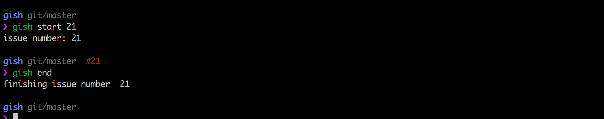

## gish - command line github workflow tool

gish exposes the following commands:


```bash
$ gish get
```
Gets most recent ~20 issues


```bash
$ gish get <issue number>
```
Gets title, description and comments of specified issue


```bash
$ gish start <issue number>
```
Assigns user to said issue and stores the number locally, if used with the custom pure zsh theme, it also adds the issue number to the command line prompt so you never have to check:




```bash
gish comment <issue number> <comment>
```
Adds a comment to specified issue number

```bash
$ gish end
```
Removes assignment on GitHub and removes the issue from command line prompt (for users with custom zsh theme set up)

```bash
$ gish browser
```
Opens the issue you are working on in the browser. If no issue is being worked on, it opens all issues view.


________________________

### Using gish

I will release as an npm package when it is a bit more dynamic and useful, for now, add the file `gish` to your `/usr/local/bin/` directory, remembering to add your GitHub user name and an access token.

#### ... with zsh

In order to get the prompt to be updated with the current issue you are working on, you need to create a custom oh-my-zsh theme in `.oh-my-zsh/custom/themes/`. You can copy mine `pure.zsh-theme`. Remember to specify the theme in your `~/.zshrc` file (if using my theme, you should have the following line in `.zshrc`: `ZSH_THEME="pure"`)
